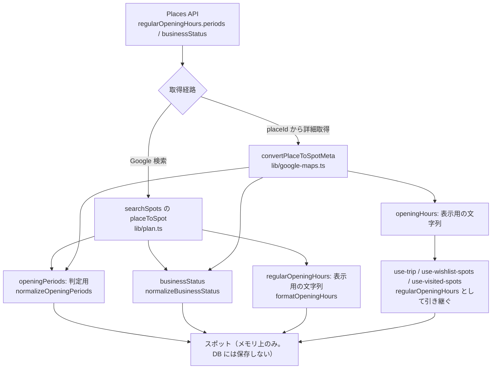
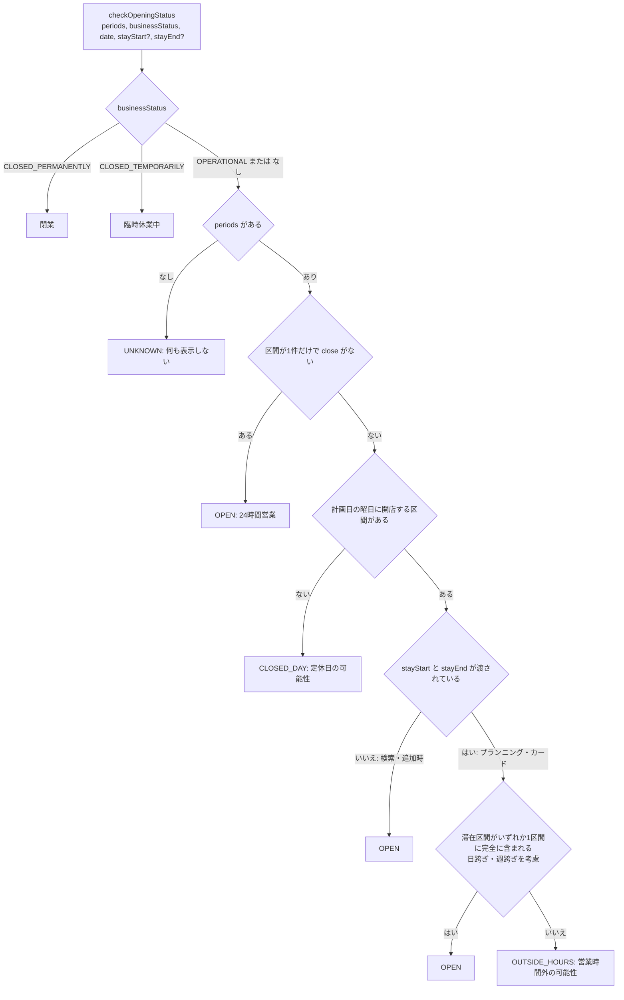
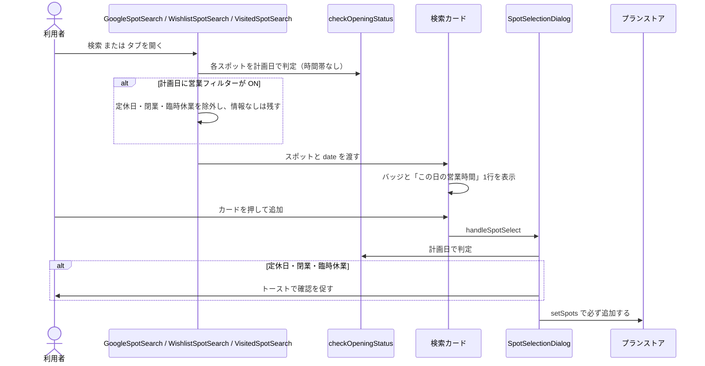
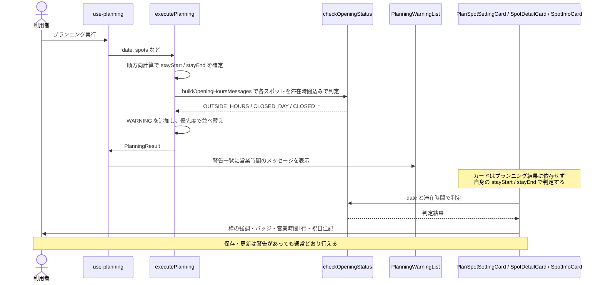

# No.158 営業時間の制御 処理フロー

実装後の処理の流れ。詳細は [No.158_実装計画.md](./No.158_実装計画.md) を参照。

## 1. 営業時間データの取得

```mermaid
flowchart TD
  A["Places API<br/>regularOpeningHours.periods / businessStatus"] --> B{"取得経路"}
  B -->|"Google 検索"| C["searchSpots の placeToSpot<br/>lib/plan.ts"]
  B -->|"placeId から詳細取得"| D["convertPlaceToSpotMeta<br/>lib/google-maps.ts"]
  C --> E["regularOpeningHours: 表示用の文字列<br/>formatOpeningHours"]
  C --> F["openingPeriods: 判定用<br/>normalizeOpeningPeriods"]
  C --> G["businessStatus<br/>normalizeBusinessStatus"]
  D --> E2["openingHours: 表示用の文字列"]
  D --> F
  D --> G
  E2 --> H["use-trip / use-wishlist-spots / use-visited-spots<br/>regularOpeningHours として引き継ぐ"]
  F --> I["スポット（メモリ上のみ。DB には保存しない）"]
  G --> I
  E --> I
  H --> I
```

## 2. 判定関数 checkOpeningStatus

```mermaid
flowchart TD
  S["checkOpeningStatus<br/>periods, businessStatus, date, stayStart?, stayEnd?"] --> A{"businessStatus"}
  A -->|"CLOSED_PERMANENTLY"| R1["閉業"]
  A -->|"CLOSED_TEMPORARILY"| R2["臨時休業中"]
  A -->|"OPERATIONAL または なし"| B{"periods がある"}
  B -->|"なし"| R3["UNKNOWN: 何も表示しない"]
  B -->|"あり"| C{"区間が1件だけで close がない"}
  C -->|"ある"| R4["OPEN: 24時間営業"]
  C -->|"ない"| D{"計画日の曜日に開店する区間がある"}
  D -->|"ない"| R5["CLOSED_DAY: 定休日の可能性"]
  D -->|"ある"| E{"stayStart と stayEnd が渡されている"}
  E -->|"いいえ: 検索・追加時"| R6["OPEN"]
  E -->|"はい: プランニング・カード"| F{"滞在区間がいずれか1区間に完全に含まれる<br/>日跨ぎ・週跨ぎを考慮"}
  F -->|"はい"| R7["OPEN"]
  F -->|"いいえ"| R8["OUTSIDE_HOURS: 営業時間外の可能性"]
```

## 3. スポット検索と追加（R1・R2）

```mermaid
sequenceDiagram
  actor U as 利用者
  participant S as GoogleSpotSearch / WishlistSpotSearch / VisitedSpotSearch
  participant J as checkOpeningStatus
  participant C as 検索カード
  participant D as SpotSelectionDialog
  participant P as プランストア

  U->>S: 検索 または タブを開く
  S->>J: 各スポットを計画日で判定（時間帯なし）
  alt 計画日に営業フィルターが ON
    S->>S: 定休日・閉業・臨時休業を除外し、情報なしは残す
  end
  S->>C: スポットと date を渡す
  C->>C: バッジと「この日の営業時間」1行を表示
  U->>C: カードを押して追加
  C->>D: handleSpotSelect
  D->>J: 計画日で判定
  alt 定休日・閉業・臨時休業
    D->>U: トーストで確認を促す
  end
  D->>P: setSpots で必ず追加する
```

## 4. プランニングとカード表示（R3・R4）

```mermaid
sequenceDiagram
  actor U as 利用者
  participant H as use-planning
  participant E as executePlanning
  participant J as checkOpeningStatus
  participant W as PlanningWarningList
  participant K as PlanSpotSettingCard / SpotDetailCard / SpotInfoCard

  U->>H: プランニング実行
  H->>E: date, spots など
  E->>E: 順方向計算で stayStart / stayEnd を確定
  E->>J: buildOpeningHoursMessages で各スポットを滞在時間込みで判定
  J-->>E: OUTSIDE_HOURS / CLOSED_DAY / CLOSED_*
  E->>E: WARNING を追加し、優先度で並べ替え
  E-->>H: PlanningResult
  H->>W: 警告一覧に営業時間のメッセージを表示
  Note over K: カードはプランニング結果に依存せず<br/>自身の stayStart / stayEnd で判定する
  K->>J: date と滞在時間で判定
  J-->>K: 判定結果
  K->>U: 枠の強調・バッジ・営業時間1行・祝日注記
  Note over U,K: 保存・更新は警告があっても通常どおり行える
```
