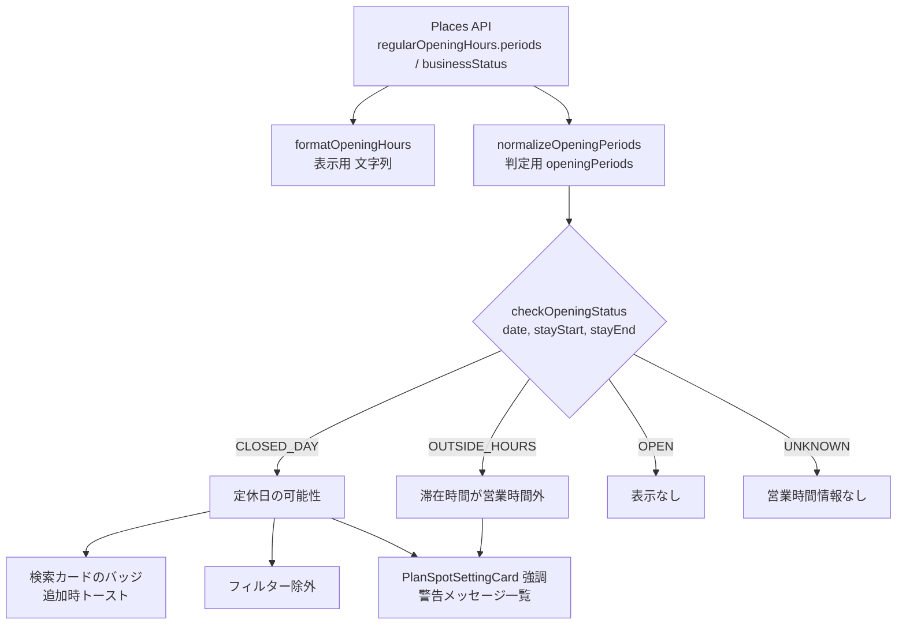

# No.158 営業時間の制御 調査報告

- Issue: https://github.com/ju-ki/moptabi/issues/158
- 調査日: 2026-10-08
- 調査対象ブランチ: `dev`（c02ea8e 時点）

## 1. 結論

Issue の要件 1〜5 はすべて **既存の構成のまま実現可能**。追加の Google API 呼び出しも不要（営業時間は既に取得済み）。

ただし、前提として次の 2 点を先に整理する必要がある。

1. **メモの前提（DB に営業時間を格納）は既に解消済み**。No.230 で SpotMeta テーブルは廃止され、現在は Google 利用規約に従い毎セッション API から取得している。「格納するか毎回呼ぶか」の判断はもう不要で、鮮度の問題も起きない。
2. **現在の営業時間データは表示用の文字列（`{ day: '月', hours: '10:00-18:00' }`）しか持っていない**ため、そのままでは「この日のこの時間帯に営業しているか」を正しく判定できない。判定用の構造化データ（Google の `periods` をそのまま正規化したもの）を追加で保持する改修が最初に必要。

## 2. 現状のコード

### 2.1 営業時間の取得経路

| 経路 | 取得関数 | 営業時間の変換 | 呼び出し元 |
|---|---|---|---|
| Google 検索（Nearby / Text） | `searchSpots`（`frontend/src/lib/plan.ts:725`） | `formatOpeningHours` → `regularOpeningHours` | `GoogleSpotSearch.tsx` |
| placeId から詳細取得 | `fetchPlaceById` → `convertPlaceToSpotMeta`（`frontend/src/lib/google-maps.ts:67,100`） | `formatOpeningHours` → `openingHours` | `place-fetcher.ts` 経由で `use-trip.ts` / `use-wishlist.ts` / `use-wishlist-spots.ts` / `use-visited-spots.ts` |

- どちらも `regularOpeningHours` フィールドを既に Places API にリクエストしている（`PLACE_DETAIL_FIELDS`、`searchSpots` の `fields`）。**判定に使うデータの追加取得コストはゼロ**。
- `searchSpots` は `businessStatus` も取得しているが、未使用。`PLACE_DETAIL_FIELDS` には含まれていない。

### 2.2 キャッシュ（Issue メモ・コメントへの回答）

`frontend/src/lib/place-fetcher.ts` の冒頭コメントの通り、規約準拠のため

- スポット詳細（営業時間・URL 含む）はメモリキャッシュのみ（セッション中）
- DB・localStorage には lat/lng 以外を保存しない

という方針が既に実装されている。よって

- Issue 本文メモ「DB に格納して API コストを抑える」→ **規約上不可で、既に廃止済み**
- コメント「website の URL も変わる可能性があるが一旦無視」→ 毎回取得なので **自動的に最新になる**
- コメント「画像も動的に？」→ 画像（`photos`）は現在 `/scene.webp` 固定。営業時間とは独立した課題なので **別 Issue に切り出すのを推奨**（写真も永続保存は不可、表示のたびに Photo API 課金が発生する点が論点）

### 2.3 営業時間データの形式と問題点

`formatOpeningHours`（`frontend/src/lib/google-maps.ts:18`）は Google の `periods` を以下に変換している。

```ts
// 例
[{ day: '月', hours: '10:00-18:00' }, { day: '火', hours: '11:00-14:00, 17:00-22:00' }]
// 特殊ケース
[{ day: '全', hours: '24時間営業' }]
[{ day: '不明', hours: '営業時間情報なし' }]
```

判定に使うには次の問題がある。

| 問題 | 内容 |
|---|---|
| 日跨ぎ営業が判定不能 | `close.day` を捨てているため、土曜 22:00〜日曜 02:00 が `土: 22:00-02:00` になり、文字列から正しく復元できない |
| 定休日が暗黙 | 定休日は「その曜日の要素が無い」ことでしか表現されない。「情報なし」との区別は特殊文字列頼み |
| 文字列パースが必要 | 判定のたびに `'HH:mm-HH:mm, ...'` をパースする必要があり、表示文言を変えると判定が壊れる |

→ 表示用の `regularOpeningHours` / `openingHours` はそのまま残し、**判定用に `openingPeriods`（構造化データ）を並行して持たせる**のが安全。

### 2.4 要件ごとの差し込みポイント

| 要件 | 差し込み先 | 既存の仕組み |
|---|---|---|
| 1. 追加時の営業日判定 | `SpotSelectionDialog.tsx` の `handleSpotSelect`（`date` を持っている唯一の追加入口）、各検索カード `cards/GoogleSpotCard.tsx` / `WishlistSpotCard.tsx` / `VisitedSpotCard.tsx` | `useToast`、上限チェックの警告 UI |
| 2. 検索時の営業有無フィルター | `GoogleSpotSearch.tsx:153`（高評価フィルターと同じ位置）、`WishlistSpotSearch.tsx` / `VisitedSpotSearch.tsx`（`// TODO: dateは営業時間のフィルターで使用予定` が既にある） | 高評価フィルター（クライアント側絞り込み） |
| 3. プランニング時の営業時間外メッセージ | `frontend/src/lib/planning.ts` の `executePlanning`（`PlanningMessage` / `PLANNING_MESSAGE_SEGMENT`）、`PlanningWarningList.tsx`、カードは `PlanSpotSettingCard.tsx` と `SpotDetailCard.tsx` | No.388 で整備された WARNING / INFO メッセージの仕組み |
| 4. 追加・更新をブロックしない | 保存時バリデーション（`planErrors`）には一切手を入れない | WARNING メッセージは既にブロックしない設計 |
| 5. 文言 | 新規定数（`frontend/src/data/constants.ts`） | — |

### 2.5 設計書との差分

`CLAUDE.md` の「設計書にない機能は実装しない」に該当するため、実装前に設計書の更新が必要。

| 設計書 | 現状の記載 | 不足 |
|---|---|---|
| `docs/画面設計書.md:293,320` | 「営業時間フィルターは後ほど追加」「計画時点での営業の有無（`opening_hours`）」 | フィルターの粒度（日単位か時間帯か）、情報なしの扱い |
| `docs/画面設計書.md:362,375` | 行きたいリスト・過去スポットのフィルター候補に「営業時間内」 | 同上 |
| `docs/pages/plan-create.md:391` / `plan-edit.md:411` / `plan-detail.md:100` | 営業時間のアコーディオン表示のみ | 追加時の警告、カードの強調表示、警告メッセージ一覧への追加 |

## 3. 実現方針

### 3.1 処理フロー



### 3.2 判定ロジック（共通の純粋関数）

`frontend/src/lib/opening-hours.ts`（新規）に UI から独立した純粋関数として置き、テストしやすくする。

```ts
type OpeningPoint = { day: number; hour: number; minute: number }; // day: 0=日〜6=土
type OpeningPeriod = { open: OpeningPoint; close?: OpeningPoint };  // close なし = 24時間営業

type OpeningStatus =
  | { kind: 'OPEN' }
  | { kind: 'CLOSED_DAY' }                         // その曜日に営業枠が無い
  | { kind: 'OUTSIDE_HOURS'; hoursOfDay: string }  // 滞在時間が営業枠からはみ出す
  | { kind: 'UNKNOWN' };                           // 営業時間情報なし

checkOpeningStatus(periods: OpeningPeriod[] | undefined, date: string, stayStart?: string, stayEnd?: string): OpeningStatus
```

- 曜日は `date`（`YYYY-MM-DD`）から算出。端末のタイムゾーンに依存しないよう `Date.UTC` で計算する。
- 週を「日曜 0:00 起点の分（0〜10079）」に展開し、日跨ぎ・週跨ぎ（土→日）を区間として扱う。
- `stayStart`/`stayEnd` を省略した場合は「その日に 1 枠でも営業があるか」だけを見る（要件 1・2 用）。
- 昼休憩のような 1 日複数枠は、滞在区間が **いずれか 1 枠に完全に収まる** なら OPEN、そうでなければ OUTSIDE_HOURS。
- 情報なし（`periods` が空 / 未取得）は UNKNOWN とし、警告は出さない（後述の質問 2）。

### 3.3 データ追加

- `packages/shared-types/src/spot/schema.ts` の `SpotMetaSchema` に `openingPeriods`（optional）と `businessStatus`（optional）を追加。backend は保存しない（受け取らない）ので DB マイグレーションは不要。
- `frontend/src/types/plan.ts` の `Spot` 型にも同フィールドを追加。
- `convertPlaceToSpotMeta` と `searchSpots` の `placeToSpot` で `place.regularOpeningHours?.periods` を正規化して詰める。
- `PLACE_DETAIL_FIELDS` に `businessStatus` を追加（`regularOpeningHours` を既に要求しているため請求 SKU は上がらない想定。実装時に料金表で再確認する）。

### 3.4 要件ごとの実装案

**要件 1: スポット追加時の営業日判定**

- 検索結果カード（3 種）に、計画日が定休日の場合「この日は定休日の可能性があります」バッジを表示。**追加前に気づける**ことを優先。
- 追加時（`handleSpotSelect`）にも定休日ならトースト（`variant: default`）で同文言を表示。追加は通常通り行う。

**要件 2: スポット検索時の営業有無フィルター**

- 高評価フィルターと同じ UI で「計画日に営業しているスポットのみ」チェックボックスを追加し、クライアント側で絞り込む。
- Google の `isOpenNow`（Text Search のみ対応）は「今この瞬間」の判定なので、未来の計画日には使えない。Nearby Search には営業時間系の絞り込みパラメータ自体がない。よって API 側フィルターは使わない。
- 注意点: API の最大取得件数 20 件を絞り込むため、結果が少なくなる。フィルター適用で何件除外したかを表示すると分かりやすい。
- 行きたいリスト・過去スポットは各スポットの詳細を `fetchPlaceDetailsWithRetry` で取得済みなので同じ関数で絞り込める。

**要件 3: プランニング時の営業時間外メッセージ**

- `executePlanning` の最後で `updatedSpots` の `stayStart`/`stayEnd` を `checkOpeningStatus` に通し、CLOSED_DAY / OUTSIDE_HOURS を `PlanningMessage`（`level: 'WARNING'`、新セグメント `OPENING_HOURS`）として追加 → 既存の `PlanningWarningList` にそのまま並ぶ。
- カードの強調は `PlanSpotSettingCard.tsx` でカード自身が `checkOpeningStatus` を呼んで算出する（プランニング結果に依存させない）。こうすると滞在時間を手で変えた直後にも表示が追従する。
  - 枠線をアンバー（`border-amber-400`）、カード上部に `AlertTriangle` + 「営業時間外の可能性」バッジ、その日の営業時間を 1 行で表示（例: `この日(土)の営業時間: 10:00-17:00`）。
- プレビュー・詳細画面の `SpotDetailCard.tsx` にも同じバッジを出す（旅行中に見返す画面なので有用）。

**要件 4: 追加・更新をブロックしない**

- `planErrors` やバックエンドのバリデーションには手を入れない。メッセージはすべて WARNING / トースト / バッジのみ。

**要件 5: 文言案**

| ケース | 文言 |
|---|---|
| 定休日 | この日は定休日の可能性があります。公式サイト等で営業日をご確認ください。 |
| 滞在時間が営業時間外 | 滞在予定（10:00〜12:00）が営業時間（11:00〜17:00）の外にかかっています。公式サイト等で営業時間をご確認ください。 |
| 休業中 / 閉業 | Google マップ上で「臨時休業中」/「閉業」と登録されています。公式サイト等で最新情報をご確認ください。 |
| 共通の注記（アコーディオン内） | 営業時間は Google マップの情報です。祝日・季節営業・最終入場時刻は反映されていない場合があります。 |

`url`（公式サイト）がある場合はメッセージ内に「公式サイトを開く」リンクを添える。

## 4. 追加提案

優先度の高い順。

1. **閉業・臨時休業の警告（推奨・低コスト）**: `businessStatus` が `CLOSED_PERMANENTLY` / `CLOSED_TEMPORARILY` のスポットに警告を出す。既に `searchSpots` で取得しているのに捨てている情報で、定休日以上に旅行当日のがっかりに直結する。検索結果では閉業スポットをデフォルトで除外してもよい。
2. **その日の営業時間をカードに 1 行表示**: 現在はアコーディオンを開かないと見えない。計画日の曜日の営業時間だけを常時表示すると、警告が出る前に自分で気づける。
3. **祝日の注意喚起**: `regularOpeningHours` は祝日を考慮しない。計画日が祝日なら「祝日のため営業時間が異なる場合があります」を INFO で出す。祝日判定にはライブラリ（例: `@holiday-jp/holiday_jp`）の追加が必要なので要相談。
4. **直近 7 日以内の計画は `currentOpeningHours` を利用**: Google の `currentOpeningHours` は今後 7 日分の臨時営業・祝日営業（`specialDays`）を反映している。週末にふらっと出かけるターゲット層には効果が大きい。フィールド追加のみで同じ SKU の想定。
5. **営業時間に合わせた自動調整の提案（将来）**: 開店前に到着する場合「開店時刻 10:00 に合わせて滞在開始を遅らせる」ワンクリック提案。No.388 の `ArrivalTimeWarning` の改善提案 UI を流用できるが、プランニングの再計算が絡むため別 Issue 推奨。
6. **画像の動的取得は別 Issue 化**: Issue コメントの画像課金の件は営業時間と論点が異なる（Photo API の単価・表示枚数の制御）ため分離を推奨。

## 5. 実装ステップと影響範囲

| Step | 内容 | 主なファイル | 規模 |
|---|---|---|---|
| 0 | 設計書更新（フィルター粒度・警告表示・文言） | `docs/画面設計書.md`, `docs/pages/plan-create.md`, `plan-edit.md`, `plan-detail.md` | S |
| 1 | 構造化データの追加と判定関数 + 単体テスト | `packages/shared-types/src/spot/schema.ts`, `frontend/src/lib/google-maps.ts`, `frontend/src/lib/plan.ts`, `frontend/src/lib/opening-hours.ts`(新規), `frontend/src/types/plan.ts`, `frontend/src/tests/lib/opening-hours.spec.ts`(新規) | M |
| 2 | 要件 1: 検索カードのバッジ + 追加時トースト | `cards/*.tsx`, `SpotSelectionDialog.tsx` | S |
| 3 | 要件 2: 検索フィルター | `GoogleSpotSearch.tsx`, `WishlistSpotSearch.tsx`, `VisitedSpotSearch.tsx` | S〜M |
| 4 | 要件 3: プランニング警告 + カード強調 | `lib/planning.ts`, `data/constants.ts`, `PlanSpotSettingCard.tsx`, `SpotDetailCard.tsx` | M |
| 5 | 追加提案 1（businessStatus） | Step 1〜4 に相乗り | S |

Step 1 が他の全ての前提。Step 2〜4 は独立しているので、CLAUDE.md のブランチ戦略に沿って `feature158` を親に `feature158-xxx` で分割できる。

バックエンドは変更なし（スポット詳細は保存しないため）。

## 6. リスク・制約

- **Google の営業時間の精度**: 祝日・季節営業・最終入場時刻は反映されない。だからこそ「ブロックしない」「HP で確認を促す」という Issue の方針は妥当。
- **フィルターで結果が減る**: 最大 20 件からの絞り込みのため、0 件になることがある。0 件時の文言を用意する。
- **営業時間情報が無いスポット**（公園・神社など）が多い。UNKNOWN を警告扱いにすると警告だらけになるため、警告対象外を推奨。
- **既存テストへの影響**: `SpotMetaType` にフィールドを追加するとテストのモックデータ（`frontend/src/tests/`、`backend/src/tests/`）は optional なので壊れない想定。

## 7. 確認したいこと

1. **フィルターの粒度**: 「計画日に営業している（日単位）」でよいか。時間帯まで見る案は、追加前は滞在時間が未確定（デフォルト 1 時間の仮置き）なので日単位を推奨。
2. **営業時間情報なしの扱い**: 警告なし・フィルターでは残す、でよいか（推奨）。
3. **追加提案 1（閉業・臨時休業）を本 Issue に含めるか**: 低コストなので含めるのを推奨。
4. **追加提案 3（祝日判定ライブラリの追加）を進めるか**。
