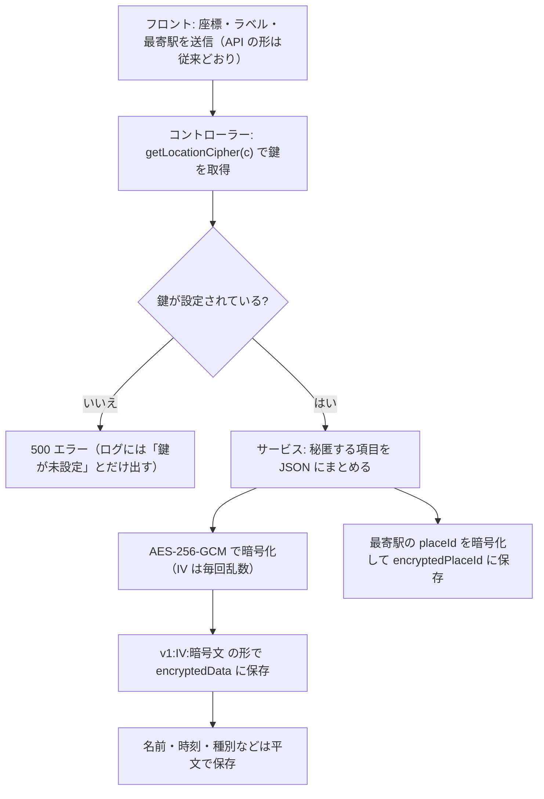
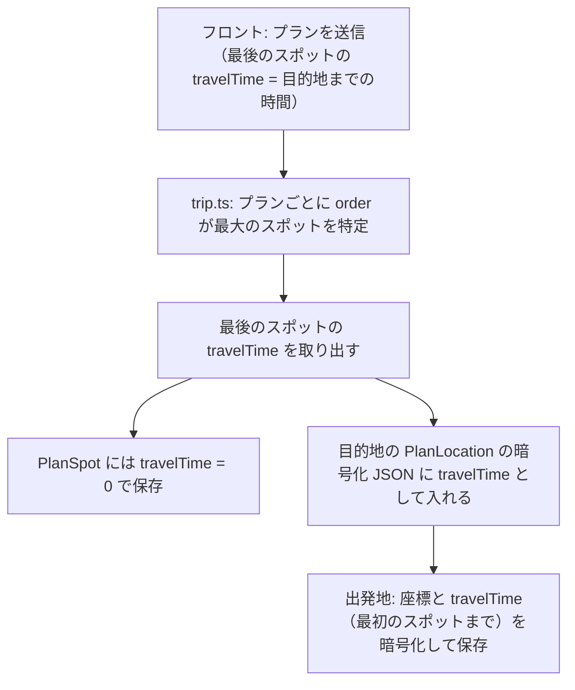
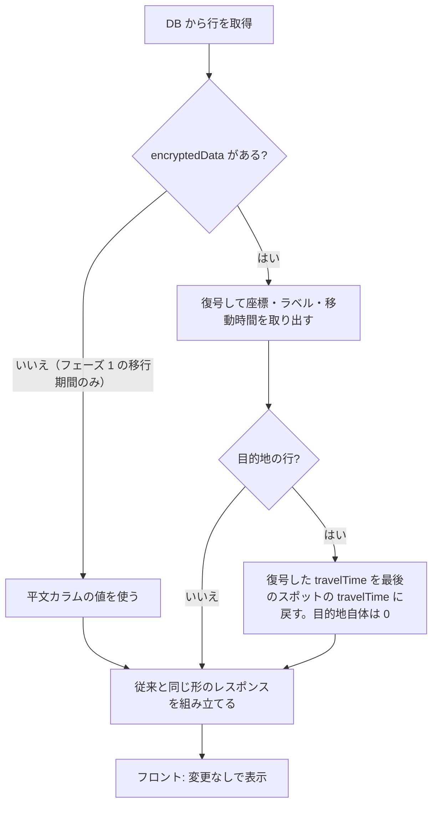
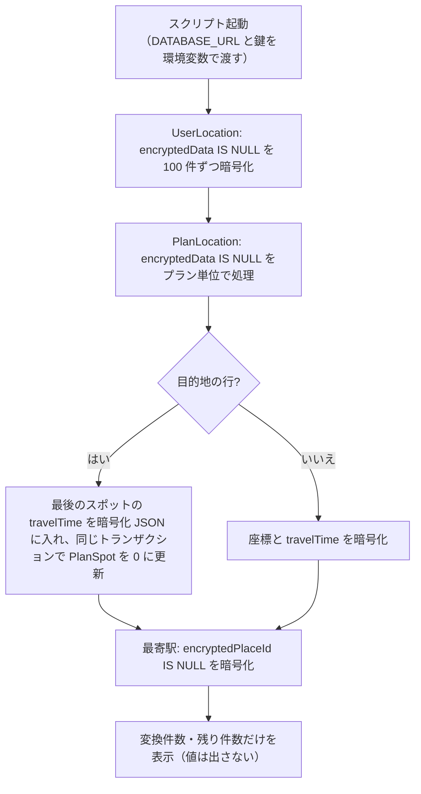
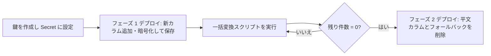

# No.168 現在地登録の秘匿化 処理フロー

## 1. 地点の保存（お気に入り地点・プランの出発地/目的地）

```mermaid
flowchart TD
  A["フロント: 座標・ラベル・最寄駅を送信（API の形は従来どおり）"] --> B["コントローラー: getLocationCipher(c) で鍵を取得"]
  B --> C{"鍵が設定されている?"}
  C -- "いいえ" --> E1["500 エラー（ログには「鍵が未設定」とだけ出す）"]
  C -- "はい" --> D["サービス: 秘匿する項目を JSON にまとめる"]
  D --> F["AES-256-GCM で暗号化（IV は毎回乱数）"]
  F --> G["v1:IV:暗号文 の形で encryptedData に保存"]
  D --> H["最寄駅の placeId を暗号化して encryptedPlaceId に保存"]
  G --> I["名前・時刻・種別などは平文で保存"]
```

## 2. 旅行プランの保存（最後のスポットの移動時間の移し替え）

```mermaid
flowchart TD
  A["フロント: プランを送信（最後のスポットの travelTime = 目的地までの時間）"] --> B["trip.ts: プランごとに order が最大のスポットを特定"]
  B --> C["最後のスポットの travelTime を取り出す"]
  C --> D["PlanSpot には travelTime = 0 で保存"]
  C --> E["目的地の PlanLocation の暗号化 JSON に travelTime として入れる"]
  E --> F["出発地: 座標と travelTime（最初のスポットまで）を暗号化して保存"]
```

## 3. 読み出し（旅行詳細・候補一覧・お気に入り一覧）

```mermaid
flowchart TD
  A["DB から行を取得"] --> B{"encryptedData がある?"}
  B -- "はい" --> C["復号して座標・ラベル・移動時間を取り出す"]
  B -- "いいえ（フェーズ 1 の移行期間のみ）" --> D["平文カラムの値を使う"]
  C --> E{"目的地の行?"}
  D --> G
  E -- "はい" --> F["復号した travelTime を最後のスポットの travelTime に戻す。目的地自体は 0"]
  E -- "いいえ" --> G["従来と同じ形のレスポンスを組み立てる"]
  F --> G
  G --> H["フロント: 変更なしで表示"]
```

## 4. 既存データの一括変換（encrypt-locations.ts）

```mermaid
flowchart TD
  A["スクリプト起動（DATABASE_URL と鍵を環境変数で渡す）"] --> B["UserLocation: encryptedData IS NULL を 100 件ずつ暗号化"]
  B --> C["PlanLocation: encryptedData IS NULL をプラン単位で処理"]
  C --> D{"目的地の行?"}
  D -- "はい" --> E["最後のスポットの travelTime を暗号化 JSON に入れ、同じトランザクションで PlanSpot を 0 に更新"]
  D -- "いいえ" --> F["座標と travelTime を暗号化"]
  E --> G["最寄駅: encryptedPlaceId IS NULL を暗号化"]
  F --> G
  G --> H["変換件数・残り件数だけを表示（値は出さない）"]
```

## 5. リリースの順番

```mermaid
flowchart LR
  A["鍵を作成し Secret に設定"] --> B["フェーズ 1 デプロイ: 新カラム追加・暗号化して保存"]
  B --> C["一括変換スクリプトを実行"]
  C --> D{"残り件数 = 0?"}
  D -- "いいえ" --> C
  D -- "はい" --> E["フェーズ 2 デプロイ: 平文カラムとフォールバックを削除"]
```
