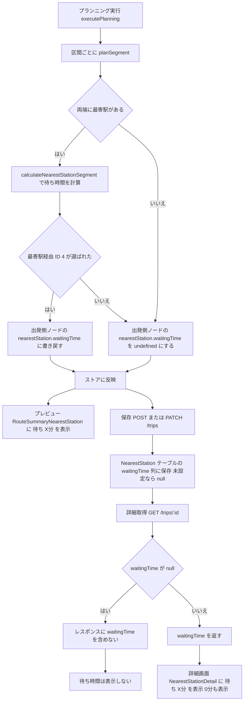

# No.375 待ち時間の表示 処理フロー

```mermaid
flowchart TD
  A["プランニング実行 executePlanning"] --> B["区間ごとに planSegment"]
  B --> C{"両端に最寄駅がある"}
  C -- "はい" --> D["calculateNearestStationSegment で待ち時間を計算"]
  C -- "いいえ" --> F
  D --> E{"最寄駅経由 ID 4 が選ばれた"}
  E -- "はい" --> G["出発側ノードの nearestStation.waitingTime に書き戻す"]
  E -- "いいえ" --> F["出発側ノードの nearestStation.waitingTime を undefined にする"]
  G --> H["ストアに反映"]
  F --> H
  H --> I["プレビュー RouteSummaryNearestStation に 待ち X分 を表示"]
  H --> J["保存 POST または PATCH /trips"]
  J --> K["NearestStation テーブルの waitingTime 列に保存 未設定なら null"]
  K --> L["詳細取得 GET /trips/:id"]
  L --> M{"waitingTime が null"}
  M -- "はい" --> N["レスポンスに waitingTime を含めない"]
  M -- "いいえ" --> O["waitingTime を返す"]
  O --> P["詳細画面 NearestStationDetail に 待ち X分 を表示 0分も表示"]
  N --> Q["待ち時間は表示しない"]
```
