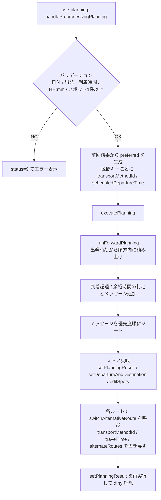
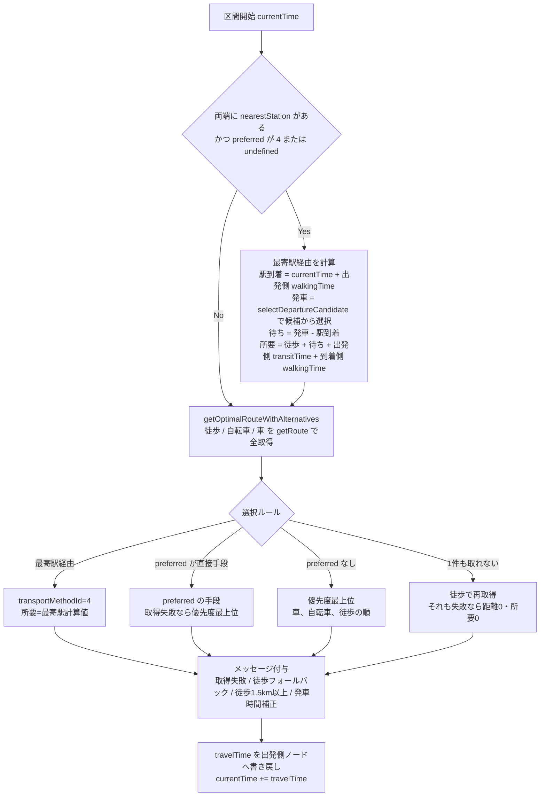

# No.388 プランニングアルゴリズムの見直し_調査報告

- 対象 Issue: https://github.com/ju-ki/moptabi/issues/388
- 調査対象: `dev` ブランチ（`2eea03d` Merge pull request #416）
- 調査日: 2026-09-30

## 0. サマリ

- プランニングは `frontend/src/lib/planning.ts` の `executePlanning` → `runForwardPlanning` で、出発時刻から区間ごとに順方向で時刻を積み上げる単純なアルゴリズムになっている。
- ただし「最寄駅経由か直接移動か」の判定と「最寄駅経由の所要時間計算」が、**区間ごと（出発地／スポット間／目的地）に3回コピーされ、さらに `getOptimalRouteWithAlternatives` 内でも再計算**されており、区間ごと・経路ごとに微妙に仕様がずれている。
- #387 で入った2つの修正は互いに打ち消し合っており、**Issue に記載の「最寄駅→別の移動手段に変更後、最寄駅を再選択できない」バグは dev で再発している**（検証テスト P1 で再現）。
- それ以外にも、検証テストで以下を再現した（詳細は「4. 怪しいバグの調査結果」）。
  - 最後のスポットで入力した発車時間候補が無視され、`['']` で上書きされる（P3）
  - 発車時間未入力時に `scheduledDepartureTimes: ['']` がストアに保存される（P4）
  - プランの移動手段から外した手段でも、前回選択していれば採用され続ける（P5）
  - 日付を跨ぐと到着超過が判定されず、余裕時間が約22時間と算出される（P6）
  - 最寄駅経由で成功している区間に「ルートが取得できませんでした」が出る（P9）
- 既存テストは `planning.ts` 単体の関数・出力形式に対してはかなり厚いが、「プランニング → 手段切替 → 再プランニング」の往復、`use-planning.ts` の preferred 生成、UI 入力値とアルゴリズムの対応関係がほぼ未検証。今回のバグはすべてこの隙間にある。

---

## 1. プランニングアルゴリズム設計（現状の dev の実装）

### 1.1 関係するファイル

| ファイル | 役割 |
| --- | --- |
| `frontend/src/hooks/use-planning.ts` | バリデーション、前回結果からの `preferredTransportMethodIds` / `preferredDepartureTimes` 生成、`executePlanning` 呼び出し、結果のストア反映 |
| `frontend/src/lib/planning.ts` | アルゴリズム本体（`executePlanning` / `runForwardPlanning` / `getOptimalRouteWithAlternatives` / 最寄駅計算 / メッセージ生成） |
| `frontend/src/lib/plan.ts` | `getRoute`（Google Directions 呼び出し）、ストア（`switchAlternativeRoute` / `editSpots` / dirty 管理） |
| `frontend/src/data/constants.ts` | `THRESHOLD_FOR_DISTANCE`(1500m)、メッセージ種別と優先度、dirty 判定対象項目 |
| `frontend/src/components/travel-plan/PlanSpotSettingCard.tsx` ほか `nearestStation/*` | 最寄駅・乗車時間・発車時間候補の入力 UI |
| `frontend/src/components/travel-plan/*DetailCard.tsx` | プレビューでの移動手段候補（`alternateRoutes`）表示と切替 |

### 1.2 データモデル

- 移動手段 ID: `0`=未設定(DEFAULT) / `1`=徒歩 / `2`=自転車 / `3`=車 / `4`=電車・バス（最寄駅経由）
  - プラン単位で選べるのは `1〜3` のみ（`constants.ts` の `TransportMethods` で `4` はコメントアウト）。`4` は「区間の両端に最寄駅がある」ときにだけアルゴリズムが生成する。
- 区間の移動情報は **出発側のノード** に持つ。
  - 出発地→スポット1: `departure.transportMethodId / travelTime / alternateRoutes`
  - スポットi→スポットi+1: `spots[i].transportMethodId / travelTime / alternateRoutes`
  - 最終スポット→目的地: `spots[last].transportMethodId ...`（`destination` は常に `0 / DEFAULT / travelTime 0`）
- 最寄駅情報 `nearestStation` は各ノードに持つ。区間計算で使う項目:
  - `walkingTime`: ノード⇔駅の徒歩時間（出発側は「駅まで」、到着側は「駅から」として使う）
  - `transitTime`: 乗車時間（**出発側ノードの値**を使う）
  - `scheduledDepartureTimes`: 発車時間候補（最大3件。出発地・スポット間は出発側ノード、**目的地区間だけ目的地ノード**の値を使う ※後述バグ B2）
  - `scheduledDepartureTime` / `waitingTime`: 計算結果として書き戻される

### 1.3 全体フロー

### 1.4 `runForwardPlanning` の区間処理

`currentTime = departure.time` から始め、次の順に処理する。

1. **出発地 → スポット1**（区間キー `DEPARTURE_TO_FIRST_SPOT`）
2. **スポットi → スポットi+1**（区間キー `SPOT_{id}_TO_{nextId}`）: 先に `stayStart = currentTime`, `stayEnd = currentTime + stayDuration` を確定し、`currentTime += stayDuration` してから移動を計算
3. **最終スポット → 目的地**（区間キー `SPOT_{id}_TO_DESTINATION`）: 同様に滞在を加算してから移動

各区間の処理は共通して以下。

#### 発車時間の選択ルール（`selectDepartureCandidate`）

| 条件 | 採用する発車時間 | メッセージ |
| --- | --- | --- |
| 候補の中に「駅到着 + 1分」以降がある | その中で最も早いもの | なし |
| 有効な候補が0件（未入力） | 駅到着 + 1分 | `DEPARTURE_CANDIDATE_EMPTY`（WARNING） |
| 候補がすべて「駅到着 + 1分」より前 | 駅到着 + 1分 | `DEPARTURE_CANDIDATE_ADJUSTED`（WARNING） |

候補は「ノードの `scheduledDepartureTimes` が1件以上あればそれ、無ければ `[preferredDepartureTime ?? '']`」。

#### 移動手段の選択ルール（`getOptimalRouteWithAlternatives`）

| useNearestStation | preferred(直接手段) | 選択 |
| --- | --- | --- |
| true | あり | preferred の直接手段（※実際には到達不能。下記 1.6） |
| true | なし | 最寄駅経由（ID 4） |
| false | あり | preferred、取れなければ優先度最上位 |
| false | なし | 優先度最上位（車 > 自転車 > 徒歩） |

- `alternativeRoutes` は `[選択ルート, ...それ以外の取得成功ルート]`。最寄駅経由を計算した場合のみ ID 4 の候補が含まれる。
- 取得対象の手段は `[...transportMethodIds, preferred]` の重複除去（`0` と `4` はスキップ）。

#### 到着判定（`executePlanning`）

- `isOverTime = 算出到着 > destination.time`
  - 超過 1〜30分: 「滞在時間をN分減らしてみましょう。」／31〜60分: 滞在か手段の見直し／61分以上: スポットの見直し
  - `arrivalWarning` に超過分・提案出発時刻を格納
- 余裕 30分以上 / 60分以上 / 90分以上 で INFO メッセージ（`EXTRA_TIME`）
- メッセージ優先度: `OVER_TIME` > `ROUTE_FETCH_FAILED` > `ROUTE_FALLBACK_WALKING` > `DEPARTURE_CANDIDATE_ADJUSTED` > `DEPARTURE_CANDIDATE_EMPTY` > `LONG_WALK_RECOMMENDATION` > `EXTRA_TIME`

### 1.5 再プランニング（preferred）の仕組み

`use-planning.ts` が前回の結果（ストア上の各ノードの `transportMethodId` と `nearestStation.scheduledDepartureTime`）から区間キー単位で preferred を作る。

- `DEPARTURE_TO_FIRST_SPOT` には `departure.transportMethodId` を **常に**入れる（`0` でも入る）。
- スポット間は `spot.transportMethodId` が truthy のときだけ入れる。
- 目的地区間は `lastSpot.transportMethodId` を常に入れる。
- `transportMethodId == 4` のときだけ `scheduledDepartureTime` を preferredDepartureTimes に入れる。

プレビューで手段を切り替えると `switchAlternativeRoute` が `transportMethodId / travelTime` を書き換え dirty を立てるため、次のプランニングでその手段が preferred として優先採用される。

### 1.6 構造上の問題点（バグの温床）

1. **最寄駅計算が同じ区間で最大3回走る**: `runForwardPlanning` 内で `calculateTotalNearestStationDuration` を呼び、同じ処理（候補抽出 → `selectDepartureCandidate` → 待ち時間）を呼び出し元でもう一度書き、さらに `getOptimalRouteWithAlternatives` → `buildNearestStationRouteInfo` → `calculateTotalNearestStationDuration` で3回目を計算している。`travelTime` は呼び出し元の計算、`alternativeRoutes` の ID 4 の duration は3回目の計算を使うため、入力が少し違うだけで両者がずれる。
2. **区間ごとのコピペ**: 出発地・スポット間・目的地の3ブロックがほぼ同じ処理のコピーで、実際に目的地区間だけ候補の参照元が違う（B2）、目的地区間だけ `transitTime` を書き戻さない、などの差分が生まれている。
3. **「最寄駅経由にするか」と「候補に最寄駅経由を出すか」が同じフラグ**: `useNearestStation` が false になると ID 4 の候補計算自体がスキップされる。#387 の2コミットはここで衝突している（B1）。
4. **デッドコード**: `useNearestStation && preferred(直接手段)` の分岐は、呼び出し側で「preferred が 4 か undefined のときだけ useNearestStation=true」にしたため到達不能。`buildRouteInfo` の「`selectedNearestStationRoute` があれば ID 4 を候補に追加」も、同じ理由で常に既に含まれており実質無効。`routeType: 'STATION_TO_STATION'` も未使用。
5. **コメントと実装の不一致**: `runForwardPlanning` の JSDoc は「最寄駅、徒歩、自転車、車の順で優先」だが、実装は「最寄駅 > 車 > 自転車 > 徒歩」（`getTransportMethodPriority`）。
6. **時刻を「0〜1439分」に丸めている**: `minutesToTime` が日付跨ぎを 00:00 に巻き戻すため、超過判定や滞在時刻が崩れる（B5）。

---

## 2. 現状のテスト観点の洗い出し

対象: `src/tests/lib/planning.spec.ts`（130件）、`src/tests/lib/plan.spec.ts`、`src/tests/lib/plan.test.ts`、`src/tests/hooks/use-planning.spec.ts`。dev でいずれも全件パスすることを確認済み（153件）。

### 2.1 `planning.spec.ts`（アルゴリズム本体）

| 観点 | 主なテスト | 備考 |
| --- | --- | --- |
| 発車時間候補の選択 | 最早の有効候補／未入力→+1分／全部過去→+1分、メッセージの有無と segmentKey | `selectDepartureCandidate` 単体 + 出発地区間 |
| 複数手段の選択 | 優先度最上位の採用、優先手段失敗時の次点採用、徒歩フォールバック、preferred の採用、preferred が `transportMethodIds` に無い場合（`getOptimalRouteWithAlternatives` 単体） | |
| 出力形式 | ルート・時刻・メッセージ・超過判定を返す、`isOverTime` | |
| travelTime の書き戻し（最寄駅なし） | 出発地／スポット／目的地 | |
| travelTime + nearestStation（最寄駅あり） | 出発地／スポット／目的地で ID 4・待ち時間・transitTime・route.duration 一致 | 目的地は「目的地側の候補を使う」前提で書かれている（B2 参照） |
| 再プランニングの preferred（最寄駅あり／なし） | 区間ごとに preferred の直接手段が採用される | 採用された手段だけを見ており、`alternativeRoutes` は未検証 |
| マトリクス（手段 単数/複数 × 最寄駅 有/無 × 候補 空/有効/過去） | totalDuration / totalDistance が合計と一致、RouteInfo の必須項目、routeType の整合 | preferred ありのケースはマトリクスに無い |
| 余裕時間メッセージ | 30/60/90分の閾値、1スポットあたり分数、`extraTimeMessage` | |
| メッセージ優先度 | 1〜7 の並び | |
| 経路失敗・長距離徒歩 | `ROUTE_FETCH_FAILED` の優先、長距離徒歩メッセージ、形式 | 最寄駅経由区間での失敗は未検証 |
| 滞在時間 | `stayStart/stayEnd` 反映、前スポットの滞在で後続がずれる | |
| 到着超過 | 1-30 / 31-60 / 61分以上、`arrivalWarning` | 日付跨ぎは未検証 |
| 長距離徒歩 | 1.5km 未満／ちょうど／60分未満表記 | |
| 手段の重複除去 | preferred と同じ手段が二重取得されない | |
| dirty 判定 | スポット／出発地・目的地の対象項目・最寄駅有無 | |

### 2.2 `plan.test.ts` / `plan.spec.ts`（ストア）

- `switchAlternativeRoute`: 区間種別ごとに `transportMethodId / travelTime / alternateRoutes` が更新される、`nearestStation` が上書きされない、dirty（A→B→A で解除）、存在しないルート ID・結果なし。
- リセット・復元: 最寄駅の追加／更新／削除後のリセット、並び替えで dirty、memo のみでは dirty にならない、復元で dirty 解除。

### 2.3 `use-planning.spec.ts`（フック）

- 出発時間／到着時間の未入力エラー、両方入力でエラーにならない、の4件のみ。
- preferred の生成、結果のストア反映、`switchAlternativeRoute` 呼び出しは未検証。

### 2.4 コンポーネントテスト

- `DepartureDetailCard` / `SpotDetailCard` / `DestinationDetailCard` / `nearestStation/*` / `PlanSpotSettingCard` は表示・入力イベント単位のテストで、「入力値がアルゴリズムのどの項目として使われるか」は検証していない。

---

## 3. 足りていない観点

優先度は「既に不具合が出ている／出そうな順」。

| # | 観点 | 優先度 | 関連バグ |
| --- | --- | --- | --- |
| T1 | **往復シナリオ**: プランニング → `switchAlternativeRoute`（4→3）→ 再プランニング → 候補に 4 が残り、再度 4 に戻せる | 高 | B1 |
| T2 | 最寄駅あり区間で preferred が直接手段のとき、`alternativeRoutes` に ID 4 が含まれ、その duration が「最寄駅経由を選んだ場合の travelTime」と一致する | 高 | B1 |
| T3 | 後から最寄駅を設定したケース: 前回 3(車) の区間の両端に最寄駅を追加 → 再プランニングで 4 が候補に出る（または 4 が選ばれる） | 高 | B1 / B6 |
| T4 | **UI 入力とアルゴリズムの対応**: 各区間で「どのノードの `transitTime` / `scheduledDepartureTimes` を使うか」を区間ごとに固定するテスト（特に目的地区間） | 高 | B2 |
| T5 | 計算結果の書き戻しでユーザー入力（`scheduledDepartureTimes` / 目的地の `transitTime`）を破壊しない | 高 | B2 / B3 |
| T6 | `use-planning` の preferred 生成（`transportMethodId` が 0 / undefined / 4 / 直接手段、発車時間の引き継ぎ、スポット並び替え後のキー） | 高 | B6 / B7 |
| T7 | プランの移動手段から外した手段を preferred にしても採用されない（`runForwardPlanning` 経由） | 中 | B4 |
| T8 | 日付跨ぎ（出発 22:00 等）で超過判定・滞在時刻が正しい、または明示的にエラーにする | 中 | B5 |
| T9 | 最寄駅経由区間で直接手段の取得が失敗したときのメッセージ | 低（今回は対応しない） | B8 |
| T10 | 片側だけ最寄駅がある区間の扱い（黙って無視するか、メッセージを出すか） | 中 | B9 |
| T11 | マトリクスに「preferred あり（1/2/3/4/0/undefined）」軸を追加 | 中 | B1 / B6 |
| T12 | 最寄駅経由の `travelTime` と `routes[i].duration` と `alternativeRoutes` の ID 4 の duration の3者一致（計算の二重化の回帰防止） | 中 | 1.6-1 |
| T13 | スポット3件以上（中間スポットに最寄駅あり／なしが混在）の一連の時刻 | 低 | |
| T14 | 全手段失敗（徒歩も失敗）時に `travelTime=0` のまま時刻が進まないことの扱い | 低 | |

---

## 4. 怪しいバグの調査結果

各項目は dev 上で使い捨ての検証テスト（付録 A）を実行して挙動を確認した。「再現済み」は実際に出力で確認したもの、「推測」はコードからの推定。

### B1. 最寄駅 → 別の手段に変更すると、最寄駅を再選択できない（Issue 記載のバグ・**dev で再発**）【再現済み】

- 再現: 出発地・スポット1 の両方に最寄駅、`preferredTransportMethodIds.DEPARTURE_TO_FIRST_SPOT = 3` で実行。
  - 結果: `selected 3, alts [3, 2, 1]` → **ID 4 が候補から消える**。
  - preferred なしの初回は `alts [4, 3, 2, 1]` で正常。
- 経緯:
  - `1d7ce5a`（#387）: `buildRouteInfo` で、`selectedNearestStationRoute` があれば ID 4 を候補に追加する処理を入れた。当時は両端に最寄駅があれば preferred に関係なく `useNearestStation=true` で最寄駅ルートを計算していたので、これで候補に 4 が戻った。
  - `3bb2eeb`（#387）: 「手段変更後にプランニング時間が変わらない」問題の修正として、`useNearestStation` の条件に `preferred == 4 || preferred == undefined` を追加。
  - その結果、preferred が直接手段だと `useNearestStation=false` → `buildNearestStationRouteInfo` 自体が呼ばれない → `selectedNearestStationRoute` が空 → `1d7ce5a` の追加処理が働かず、4 が候補から消える。
- 根本原因: 「最寄駅経由を**採用する**か」と「最寄駅経由を**候補として計算する**か」を同じ `useNearestStation` で制御していること（1.6-3）。
- 修正方針: 両端に最寄駅があれば最寄駅ルートは常に計算して候補に入れ、採用するかどうかだけを preferred で決める。`travelTime` は採用したルートの値を使う。

### B2. 最後のスポットで入力した発車時間候補が無視され、`['']` で上書きされる【再現済み】

- 再現: 最終スポットの最寄駅に `scheduledDepartureTimes: ['12:30']`、目的地の最寄駅は候補なしで実行。
  - 結果: `departure 11:22 cands ['']`、メッセージ `DEPARTURE_CANDIDATE_EMPTY:SPOT_b_TO_DESTINATION`。**入力した 12:30 が使われず「未入力」扱いになり、スポット側の候補が `['']` に置き換わる。**
- 原因: 目的地区間だけ候補を `params.destination.nearestStation.scheduledDepartureTimes` から取っている（`planning.ts` 目的地区間の `candidates`）。一方で:
  - 発車時間候補の入力欄は `PlanSpotSettingCard`（最終スポット側）にしか表示されない。`NearestStationDestination` は候補の state とハンドラは持っているが入力欄を描画しておらず、保存される値は常に `[]`。
  - `use-planning.ts` の preferredDepartureTimes も `lastSpot.nearestStation.scheduledDepartureTime` から取っている。
  - `transitTime` は出発側（最終スポット）の値を使っている。
  - 既存テスト「travelTime+nearestStation の項目の検証(最寄駅あり) > 目的地」は、目的地側に候補を置く前提で書かれているため、この不整合を固定化してしまっている。
- 付随: 目的地区間の計算後に `updatedDestination.nearestStation.transitTime = 0` で上書きしており、目的地側で見積もった乗車時間も毎回消える。
- 修正方針: 目的地区間も「出発側ノード（最終スポット）の候補」を使う形に統一し、既存テストの前提を修正する。

### B3. 発車時間未入力のとき `scheduledDepartureTimes: ['']` がストアに保存される【再現済み】

- 再現: 出発地・スポット1 に最寄駅（候補なし）で実行 → `updatedDeparture.nearestStation.scheduledDepartureTimes = [""]`。
- 原因: 候補が空のとき `[preferredDepartureTime ?? '']` を「候補」として作り、それを計算結果としてノードに書き戻している（3区間とも）。
- 影響（推測）: 次回以降は「候補が1件ある」とみなされるため preferredDepartureTime が使われなくなる。また前回の自動補正時刻が「ユーザー入力の候補」として残り、フォーム側の初期値にも混ざる。
- 修正方針: 計算用の候補と保存する `scheduledDepartureTimes` を分け、ユーザー入力値はそのまま保持する。

### B4. プランの移動手段から外した手段でも、前回選択していれば採用され続ける【再現済み】

- 再現: `transportMethodIds = [1]`（徒歩のみ）、`preferred = 3` で実行 → `selected 3`（車）。
- 原因: `runForwardPlanning` が `[...params.transportMethodIds, preferred]` で取得対象を作っているため、preferred が常に取得・採用される。
- 既存テスト「【異常系】優先移動手段 ID が `transportMethodIds` に含まれていない場合は採用されない」は `getOptimalRouteWithAlternatives` 単体に対するもので、`runForwardPlanning` 経由では逆の挙動になっている。
- 修正方針: preferred が `transportMethodIds` に含まれない（かつ 4 でない）場合は無視する。

### B5. 日付を跨ぐと到着超過が判定されない【再現済み】

- 再現: 出発 22:00、到着 23:30、滞在 90分×2 → `arrival 01:24, isOver false, extra 1326`、「新しいスポットを追加して…」が表示される。
- 原因: `minutesToTime` が 24時間で剰余を取るため、到着が 00:00 以降に巻き戻ってから比較している。`stayStart/stayEnd` も同様に巻き戻る。
- 修正方針: 内部計算は通算分のまま持ち、比較は通算分で行う。表示だけ HH:mm にする（または日付跨ぎを明示的にエラー／警告にする）。

### B6. 後から最寄駅を設定しても、前回の手段が残っていると最寄駅経由にならない【推測（B1 と同じ原因）】

- 流れ: 最寄駅なしでプランニング → 区間の手段が 3(車) で保存 → 到着側ノードにだけ最寄駅を追加（`PlanSpotSettingCard` は**そのスポット自身**の `transportMethodId` を 4 にするが、到着側として使われる区間の手段は前のノードが持っている）→ preferred=3 のままなので `useNearestStation=false`、候補にも 4 が出ない。
- 目的地の最寄駅を設定する `NearestStationDestination` は `lastSpot.transportMethodId` を触らないため、目的地区間でも同じことが起きる。
- 付随: `preferred = 0`（初期値）でも `0 == undefined` は false なので最寄駅経由にならない（検証 P2 で `selected 3`）。出発地は `Departure.tsx` / `NearestStationDeparture.tsx` で最寄駅設定時に 4 を入れているため通常は顕在化しないが、`0` を「未設定」として扱えていない。

### B7. スポットの並び替え後に、前の区間の手段・発車時間が別の区間に引き継がれる【推測】

- preferred は「そのスポットの `transportMethodId` → 現在の次のスポット」というキーで作られる。並び替えで次のスポットが変わっても、前の組み合わせで選んだ手段・発車時間が新しい区間に優先採用される。
- 並び替えは dirty の対象だが、preferred をリセットする処理は無い。

### B8. 最寄駅経由で成功している区間に「ルートが取得できませんでした」が出る【再現済み】

- 再現: 両端に最寄駅、`getRoute` をすべて失敗させる → 出発地区間は 4 が選ばれて所要時間も出るが、`ROUTE_FETCH_FAILED:DEPARTURE_TO_FIRST_SPOT`（最優先の警告）も出る。
- 原因: `pushRouteFailureMessages` が、選択ルートが最寄駅経由かどうかを見ずに「失敗一覧に徒歩が含まれるか」だけで判定している。
- 影響: 徒歩・自転車・車のルートが1件も取れない区間（Google 側でルートが引けない、API エラーなど）で、最寄駅経由を採用してプラン自体は組めているのに、最優先（優先度2）の警告として「ルートが取得できませんでした。スポットの見直しをしてください。」が一番上に表示される。ユーザーからは「プランが失敗したのか、成功したのか」が分からない。発生頻度は低い。
- 対応案: 選択ルートが最寄駅経由のときは `ROUTE_FETCH_FAILED` を出さない、または「徒歩・車などの候補は取得できませんでした（最寄駅経由で計算しています）」のような弱い文言にする。

### B9. 片側だけ最寄駅がある区間は黙って直接移動になる【再現済み・仕様確認が必要】

- 再現: 出発地にだけ最寄駅 → 徒歩が選ばれ、`LONG_WALK_RECOMMENDATION`（「最寄駅を推奨します」）が出る。既に最寄駅を設定しているユーザーには分かりにくい。

### その他（軽微・仕様確認）

- `PlanSpotSettingCard` の乗車時間の初期見積もりが、別の区間の距離で計算されている。
  - スポット X のカードで最寄駅を選ぶと、乗車時間 `transitTime` が `estimateTransitTime(distanceFromPrevious)` で自動入力される。`distanceFromPrevious` は「**前のスポット → X**」の距離。
  - 一方アルゴリズムは X の `transitTime` を「**X → 次のスポット**」の乗車時間として使う（1.2 の「出発側ノードの値を使う」）。
  - 例: 前のスポット → X が 1km、X → 次が 10km のとき、10km 乗る区間に 1km 分の見積もりが初期値として入る。ユーザーが手で直せば問題ないため、影響は初期値だけ。
  - `NearestStationDeparture` は「出発地 → スポット1」の距離で見積もっており、こちらは正しい。
- `SpotSettingEditor` の `getDistanceFromPrevious` は `spots[index - 1]` を使い、`nextSpot` は `sortedSpots[index + 1]` を使っている。`spots` の並び順次第で前スポットがずれる可能性がある。
- 最寄駅経由ルートの `distance` は直線距離（`calcDistance2`）の合計で、小数のまま返している。 `calcDistance2` は `calcDistance`（`frontend/src/lib/algorithm.ts`）と中身が同じ仮メソッドのため、`calcDistance` に置き換える。
- 全手段（徒歩含む）が失敗すると `duration=0` のルートになり、時刻が進まないまま後続が計算される（メッセージは出る）。

---

## 5. 見直しの進め方（提案）

1. **テストを先に足す**（T1〜T6）。B1〜B4 は失敗するテストとして先に入れ、修正の完了条件にする。既存の「目的地」テストは B2 の方針が決まり次第前提を直す。
2. **区間計算を1つの関数に統一する**。`planSegment({ from, to, fromStation, toStation, currentTime, preferredMethodId, preferredDepartureTime, transportMethodIds })` のような形で、出発地／スポット間／目的地の3ブロックを置き換える。
   - 最寄駅ルートは両端に最寄駅があれば常に1回だけ計算し、`travelTime` と候補の両方でその値を使う（B1・1.6-1 の解消）。
   - 候補の参照元は「出発側ノード」に統一（B2）。
   - 計算用の候補と保存値を分ける（B3）。
   - preferred は `transportMethodIds ∪ {4}` に含まれる場合のみ有効（B4）。
3. **時刻は通算分で扱う**（B5）。
4. `use-planning.ts` の preferred 生成を関数に切り出してテスト可能にし、`0` の扱い・並び替え時のリセットを決める（B6・B7）。
5. 仕様確認が必要な点（B9、目的地側の乗車時間入力の要否）は別途決める。

---

## 6. レビューでの決定事項（2026-09-30）

PR #418 のレビューコメントで決まった対応方針。

| 項目 | 方針 |
| --- | --- |
| B1 最寄駅を再選択できない | 対応する（Issue の本題） |
| B2 最後のスポットの発車時間候補が無視される | 直す |
| B3 `['']` がストアに保存される | 直す。#371（発車時間の選択機能）に影響するため |
| B4 外した移動手段が採用され続ける | 直す。ユーザーがプランニングをやり直す回数が増えるため |
| B5 日付跨ぎ | 23:59 を超えた場合にエラーメッセージを出す。日付ごとに独立しているので他の日付への影響はない |
| B6 後から最寄駅を設定しても反映されない | B1 と合わせて対応 |
| B7 並び替え後に手段が別の区間へ引き継がれる | 対応する。移動手段を細かく変える想定はなかったが、距離や所要時間で変わりうるため |
| B8 最寄駅経由で成功しているのに取得失敗メッセージ | 発生頻度が低いため今回は対応しない |
| B9 片側だけ最寄駅がある区間 | 挙動は仕様どおり。ただし分かりづらいので、今回の対応で警告メッセージを表示する |
| 乗車時間の初期見積もり | 説明を追記（4 章 その他）。対応要否は要確認 |
| `calcDistance2` | 仮メソッドのため `calcDistance` に置き換える |
| 全手段失敗時に時刻が進まない | 頻度が低いため今回は対応しない |
| テスト | 見づらさもバグの一因のため、観点ごとに追いやすいテスト構造に組み直す |

---

## 付録 A. 検証に使ったテスト（使い捨て・未コミット）

`frontend/src/tests/probe/probe388.spec.ts` として一時的に作成し、`getRoute` をモック（徒歩30分/2000m、自転車15分/2000m、車8分/2500m）して `executePlanning` を実行した。主な結果:

| ID | 条件 | 結果 |
| --- | --- | --- |
| P1 | 両端に最寄駅、preferred=3 | `selected 3, alts [3,2,1]`（4 が消える） |
| P1b | 両端に最寄駅、preferred なし | `selected 4, alts [4,3,2,1]` |
| P2 | 両端に最寄駅、preferred=0 | `selected 3` |
| P3 | 最終スポットに候補 12:30、目的地は候補なし | `11:22`、候補 `['']`、`DEPARTURE_CANDIDATE_EMPTY` |
| P4 | 候補なしで最寄駅経由 | 保存値 `[""]` |
| P5 | `transportMethodIds=[1]`, preferred=3 | `selected 3` |
| P6 | 22:00 出発、23:30 到着、滞在 90分×2 | `arrival 01:24, isOver false, extra 1326` |
| P7 | 出発地のみ最寄駅 | 徒歩＋`LONG_WALK_RECOMMENDATION` |
| P9 | 両端に最寄駅、getRoute 全失敗 | 出発地区間は 4 採用だが `ROUTE_FETCH_FAILED` あり |
| P10 | スポット間、候補なし、preferredDepartureTime=11:00 | travelTime と route.duration は一致（67分） |
