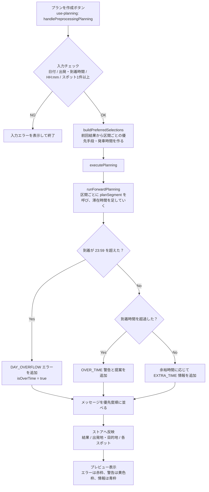
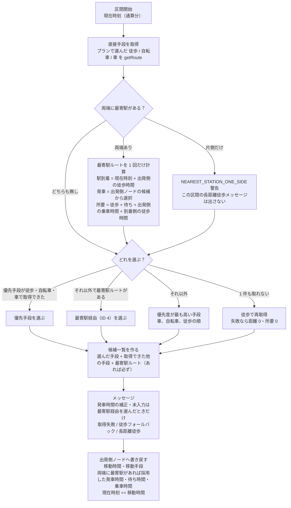
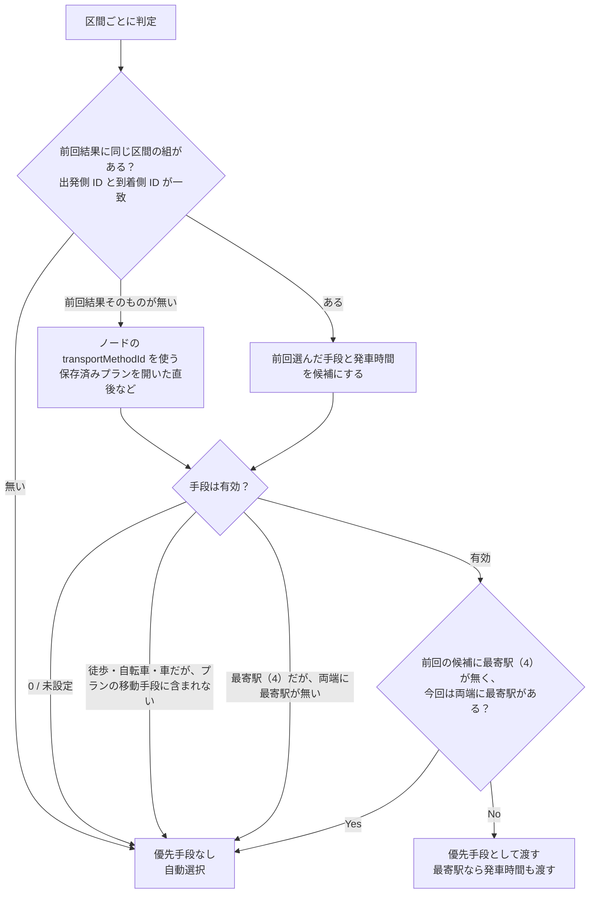
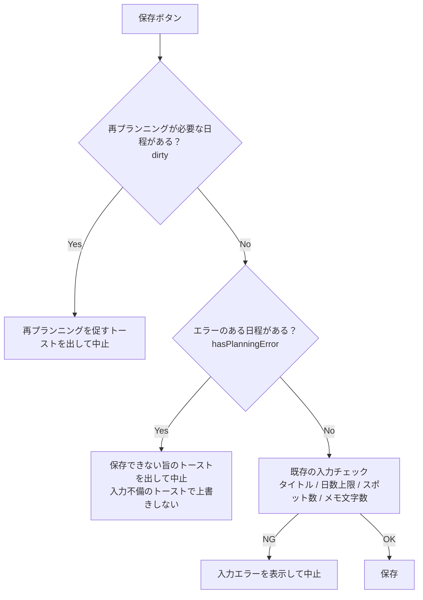

# No.388 プランニング処理フロー（見直し後）

- `docs/tasks/No.388_実装計画.md` を実装したあとのプランニング処理の流れをまとめたもの。現状（見直し前）の流れは `docs/tasks/No.388_プランニングアルゴリズムの見直し_調査報告.md` の「1. プランニングアルゴリズム設計」を参照。
- feature388 の実装に合わせて最終化済み。実装計画から変わった点・実装時に決めた点は「6. 実装時に決めた点」にまとめた。
- 主な実装箇所: `frontend/src/lib/planning.ts`（`planSegment` / `runForwardPlanning` / `buildPreferredSelections` / `hasPlanningError` / `executePlanning`）、`frontend/src/hooks/use-planning.ts`、`frontend/src/components/travel-plan/PlanningWarningList.tsx`、`frontend/src/components/CreatePlanButton.tsx`。

## 1. 全体の流れ

## 2. 区間の計算（planSegment）

出発地 → スポット1、スポット間、最終スポット → 目的地のすべてでこの処理を使う。

### 発車時間の選び方

| 条件 | 採用する発車時間 | メッセージ |
| --- | --- | --- |
| 出発側ノードの候補に「駅到着 + 1分」以降がある | その中で最も早いもの | なし |
| 候補が空で、前回採用した発車時間がある | 前回の発車時間を候補として同じルールで選ぶ | なし（前回の時刻が過去なら補正の警告） |
| 候補が空で、前回の発車時間も無い | 駅到着 + 1分 | 発車時間未入力の警告 |
| 候補がすべて「駅到着 + 1分」より前 | 駅到着 + 1分 | 発車時間補正の警告 |

- 候補は**出発側ノード**のもの（出発地 → スポット1 は出発地、スポット間は前のスポット、最終スポット → 目的地は最終スポット）。
- ノードに保存する `scheduledDepartureTimes` はユーザーが入力した配列のまま。書き戻すのは採用した `scheduledDepartureTime` と `waitingTime` だけ。

## 3. 再プランニング時の優先手段（buildPreferredSelections）

## 4. メッセージ一覧（見直し後）

| 優先度 | 種別 | レベル | 表示 | 保存 |
| --- | --- | --- | --- | --- |
| 0 | `DAY_OVERFLOW` 到着が 23:59 を超える | エラー | 赤枠 | できない |
| 1 | `OVER_TIME` 到着時間を超過 | 警告 | 黄色枠 | できる |
| 2 | `ROUTE_FETCH_FAILED` ルート取得失敗 | 警告 | 黄色枠 | できる |
| 3 | `ROUTE_FALLBACK_WALKING` 徒歩にフォールバック | 警告 | 黄色枠 | できる |
| 4 | `DEPARTURE_CANDIDATE_ADJUSTED` 発車時間を補正 | 警告 | 黄色枠 | できる |
| 5 | `DEPARTURE_CANDIDATE_EMPTY` 発車時間が未入力 | 警告 | 黄色枠 | できる |
| 6 | `NEAREST_STATION_ONE_SIDE` 片側だけ最寄駅 | 警告 | 黄色枠 | できる |
| 7 | `LONG_WALK_RECOMMENDATION` 徒歩で 1.5km 以上 | 警告 | 黄色枠 | できる |
| 8 | `EXTRA_TIME` 余裕時間の提案 | 情報 | 青枠 | できる |

- エラーが 1 件でもある日程があると、プレビューに「エラーがあるため、このプランニング結果は保存できません。」を表示し、保存ボタンを押してもトーストを出して保存しない。

## 5. 保存時のチェック（CreatePlanButton）

## 6. 実装時に決めた点

| 項目 | 内容 |
| --- | --- |
| `getOptimalRouteWithAlternatives` の引数 | 最寄駅の計算を `planSegment` に移したため、`(from, to, transportMethodIds, preferredTransportMethodId?)` に減らした（実装計画 2.1 では「シグネチャは変えない」としていた）。呼び出し元は既存テストだけ。 |
| 最寄駅の計算結果の書き戻し | 両端に最寄駅がある区間では、直接手段を選んだ場合も採用した発車時間・待ち時間・乗車時間を出発側ノードに書き戻す。プレビューで最寄駅経由に切り替えたときに表示する発車時間が古いままにならないようにするため。 |
| 発車時間のメッセージ | 発車時間の補正・未入力の警告は、最寄駅経由を選んだ区間だけに出す。直接手段を選んだ区間には関係しないため。 |
| 日付を跨ぐ発車時間 | 駅到着が 24:00 以降になった場合も、待ち時間は同じ日の中で計算する（候補はすべて「到着より前」として補正される）。到着が 23:59 を超えるためエラーになり、保存はできない。 |
| 保存ブロック時のトースト | トーストは 1 件しか表示されないため、dirty・エラーで止めたときは「入力項目に一部不備があります」のトーストを出さない。dirty のトーストもこれまでは上書きされて見えていなかった。 |
| 発車時間候補の入力欄の初期値 | 候補が空配列のときは、プランニングで自動設定された発車時間を入力欄に表示しない（`PlanSpotSettingCard` / `NearestStationDeparture`）。保存済みプランを開いたとき（候補が未設定で採用済みの発車時間だけがある）は、これまでどおり採用済みの発車時間を表示する。動作確認手順 2-4 のため。 |
| `calcDistance2` | `frontend/src/lib/algorithm.ts` から削除し、`planning.ts` は `calcDistance` を使う。 |
