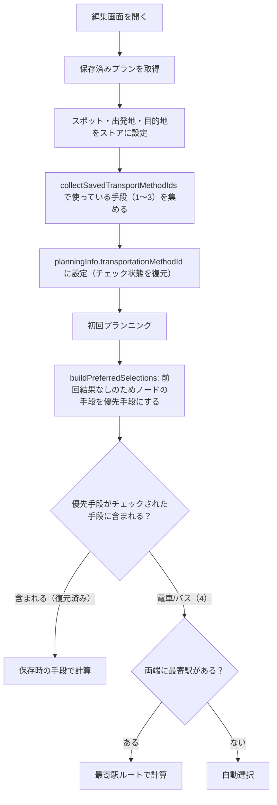

# No.388 動作確認バグ修正計画

`docs/test/No.388_動作確認手順.md` の動作確認で見つかった不具合2件の原因と修正方針をまとめる。

## 1. 不具合

| No | 手順 | 実際の結果 |
| --- | --- | --- |
| 9-2 | 保存済みのプラン（最寄駅なし）を編集画面で開き、何も変えずにプラン作成 | 全区間が徒歩になる（詳細画面は保存時の手段で正しい） |
| 追記 | 最寄駅ありでプラン作成して保存 → 候補ボタンで車に切り替えてプラン作成して保存 → 編集画面で開く | 全区間が最寄駅（電車/バス）になる |

## 2. 原因（2件とも同じ）

編集画面では移動手段のチェックボックス（`Transportation`）が「全て未選択」で始まる（`docs/pages/plan-edit.md` の Transportation 初期表示）。チェック状態は DB に保存しておらず、`planningInfo[date].transportationMethodId` が `[]` になる。

今回の実装（3-2「チェックを外した手段は使わない」）で、優先手段はチェックされた手段に含まれるときだけ使う（`isUsablePreferredMethod`、`frontend/src/lib/planning.ts`）ようにした。そのため、保存済みの手段（車など）は次のように扱われる。

1. `buildPreferredSelections` で保存済みの手段（1〜3）が「チェックされていない手段」として捨てられる。
2. `planSegment` の直接ルート取得（`fetchDirectRoutes`）もチェックされた手段だけを取得するため、何も取得しない。
3. 結果は次のとおり。
   - 両端に最寄駅がない区間は、徒歩フォールバックになる（9-2）。
   - 両端に最寄駅がある区間は、最寄駅ルートが選ばれる（追記）。

dev では保存済みの手段を取得対象に追加していた（`[...transportMethodIds, preferredMethodId]`）ため、この問題は起きていなかった。今回の変更によるデグレ。

## 3. 修正方針

### 案A（推奨）: 編集画面を開いたときに、保存済みプランで使っている移動手段にチェックを入れる

- 変更するもの
  - 編集画面を開いたときに、その日のプランで使っている移動手段（徒歩・自転車・車）を集めてチェック状態に復元する。
  - 対象は出発地と各スポットの `transportMethodId` のうち 1〜3。電車/バス（4）はチェックボックスがないため対象外。
- 変えないもの
  - 3-2 のルール（チェックを外した手段は使わない）は変えない。
- 結果
  - 画面のチェック状態とプランニングで使う手段が一致する。
  - 2回目以降の再プランニングでも同じ動きになる。
- 注意点
  - `docs/pages/plan-edit.md` の「初期表示: 全て未選択」を変更する必要がある。

### 案B: チェックが空のときだけ、保存済みの手段を取得対象に足す（dev の動き）

- 内容
  - 画面上はチェックなしのまま、保存済みの手段で計算する。
- 問題点
  - チェック表示とプランニング結果が食い違う。
  - チェックを1つでも入れると、保存済みの手段が使われなくなり、急に動きが変わる。

案A で進める。

## 4. 変更ファイル

| ファイル | 変更内容 |
| --- | --- |
| `frontend/src/lib/planning.ts` | `collectSavedTransportMethodIds(plan: TravelPlanType): number[]` を追加する。出発地と各スポットの `transportMethodId` から、`TransportMethods`（1〜3）に含まれるものを重複なく昇順で返す |
| `frontend/src/app/plan/[id]/edit/page.tsx` | 保存済みプランを読み込む `useEffect`（`trip.plans.forEach`）で、`fields.setPlanningInfo(plan.date, { transportationMethodId: collectSavedTransportMethodIds(plan) })` を呼ぶ。初回プランニングの `useEffect` より前に実行されるため、初回プランニングから復元したチェック状態で計算される |
| `docs/pages/plan-edit.md` | Transportation の初期表示を「保存済みプランで使っている移動手段（徒歩・自転車・車）にチェックが入る」に変更する |
| `docs/test/No.388_動作確認手順.md` | 「10. 編集画面の移動手段の引き継ぎ」を追加する（下記 6.） |

## 5. テスト

| ファイル | 追加するテスト |
| --- | --- |
| `frontend/src/tests/lib/planning/replanning.spec.ts` | `collectSavedTransportMethodIds`: 出発地とスポットの手段を重複なく返す／4・0 は含めない／全区間が電車/バスのときは空配列 |
| 同上 | 回帰テスト: 保存済みプラン（前回結果なし）で車の区間がある場合、`collectSavedTransportMethodIds` で求めた手段を `transportMethodIds` に渡すと、`buildPreferredSelections` が車を優先手段として返す。両端に最寄駅があっても車を返す（追記のケース） |
| `frontend/src/tests/app/plan-edit/page.spec.tsx`（新規） | 保存済みプランを読み込むと、その日の `planningInfo.transportationMethodId` に保存済みの手段が入る。`useFetchTripDetail` と `usePlanning` はモックする（API 取得とルート計算を外部に出さないため） |

TDD で進める（先に失敗するテストを追加 → 修正）。

## 6. 動作確認手順（`docs/test/No.388_動作確認手順.md` に追加）

| No | 手順 | 期待結果 |
| --- | --- | --- |
| 10-1 | 最寄駅なし・移動手段すべてでプラン作成し、スポット1 → スポット2 を候補ボタンで「徒歩」に切り替えてプラン作成して保存する。編集画面で開く | 移動手段のチェックが「徒歩」「車」に入っている。各区間の移動手段が保存時と同じ（9-2 の再確認） |
| 10-2 | 10-1 のあと、何も変えずにプラン作成 | 各区間の移動手段が保存時と同じまま |
| 10-3 | 出発地とスポット1 に最寄駅を設定してプラン作成して保存 → 候補ボタンで「車」に切り替えてプラン作成して保存 → 編集画面で開く | 出発地 → スポット1 が車のまま（最寄駅にならない）。候補ボタンに「電車/バス」がある |
| 10-4 | 10-3 のあと、移動手段の「車」のチェックを外してプラン作成 | 出発地 → スポット1 が車以外（電車/バスなど）になる（3-2 のルールどおり） |
| 10-5 | 全区間が電車/バスのプランを保存し、編集画面で開く | 移動手段のチェックは全て未選択。各区間は電車/バスのまま |

## 7. 処理フロー（編集画面の初期表示）

