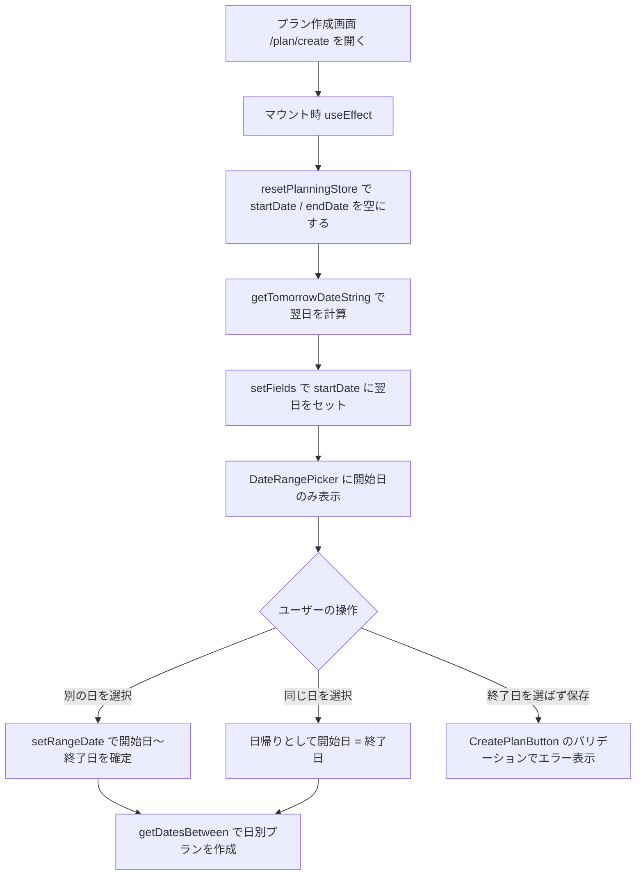

# No.409 予定日デフォルト値 処理フロー

```mermaid
flowchart TD
  A["プラン作成画面 /plan/create を開く"] --> B["マウント時 useEffect"]
  B --> C["resetPlanningStore で startDate / endDate を空にする"]
  C --> D["getTomorrowDateString で翌日を計算"]
  D --> E["setFields で startDate に翌日をセット"]
  E --> F["DateRangePicker に開始日のみ表示"]
  F --> G{"ユーザーの操作"}
  G -- "別の日を選択" --> H["setRangeDate で開始日〜終了日を確定"]
  G -- "同じ日を選択" --> I["日帰りとして開始日 = 終了日"]
  G -- "終了日を選ばず保存" --> J["CreatePlanButton のバリデーションでエラー表示"]
  H --> K["getDatesBetween で日別プランを作成"]
  I --> K
```

編集画面 `/plan/[id]/edit` は従来どおり `resetPlanningStore` の後に既存プランの日付を `setRangeDate` でセットするため、翌日は入らない。
