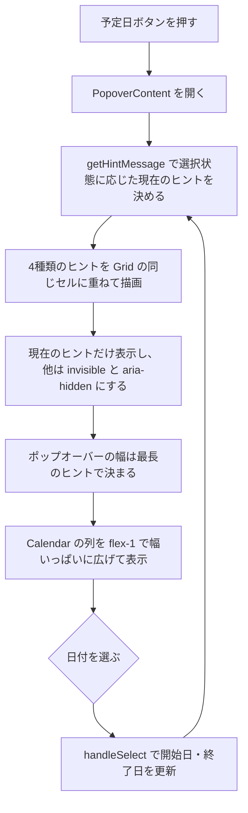

# No.439 カレンダーの幅固定 処理フロー

```mermaid
flowchart TD
  A["予定日ボタンを押す"] --> B["PopoverContent を開く"]
  B --> C["getHintMessage で選択状態に応じた現在のヒントを決める"]
  C --> D["4種類のヒントを Grid の同じセルに重ねて描画"]
  D --> E["現在のヒントだけ表示し、他は invisible と aria-hidden にする"]
  E --> F["ポップオーバーの幅は最長のヒントで決まる"]
  F --> G["Calendar の列を flex-1 で幅いっぱいに広げて表示"]
  G --> H{"日付を選ぶ"}
  H --> I["handleSelect で開始日・終了日を更新"]
  I --> C
```

選択状態が変わって表示するヒントが変わっても、描画される文言の組み合わせは同じため、ポップオーバーの幅と高さは変わらず、カレンダーの位置も動かない。
