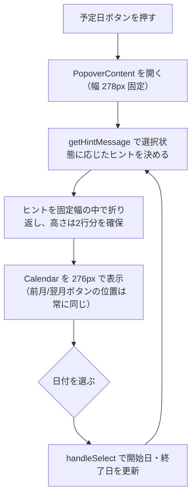

# No.439 カレンダーの幅固定 処理フロー

```mermaid
flowchart TD
  A["予定日ボタンを押す"] --> B["PopoverContent を開く（幅 278px 固定）"]
  B --> C["getHintMessage で選択状態に応じたヒントを決める"]
  C --> D["ヒントを固定幅の中で折り返し、高さは2行分を確保"]
  D --> E["Calendar を 276px で表示（前月/翌月ボタンの位置は常に同じ）"]
  E --> F{"日付を選ぶ"}
  F --> G["handleSelect で開始日・終了日を更新"]
  G --> C
```

選択状態が変わってヒントの文言が変わっても、ポップオーバーの幅とヒントの高さは変わらないため、カレンダーの位置は動かない。
